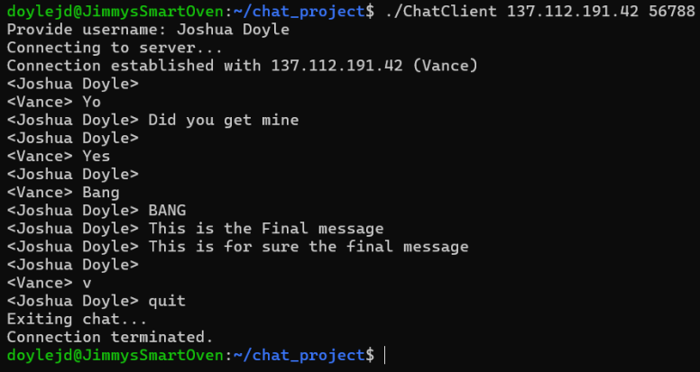
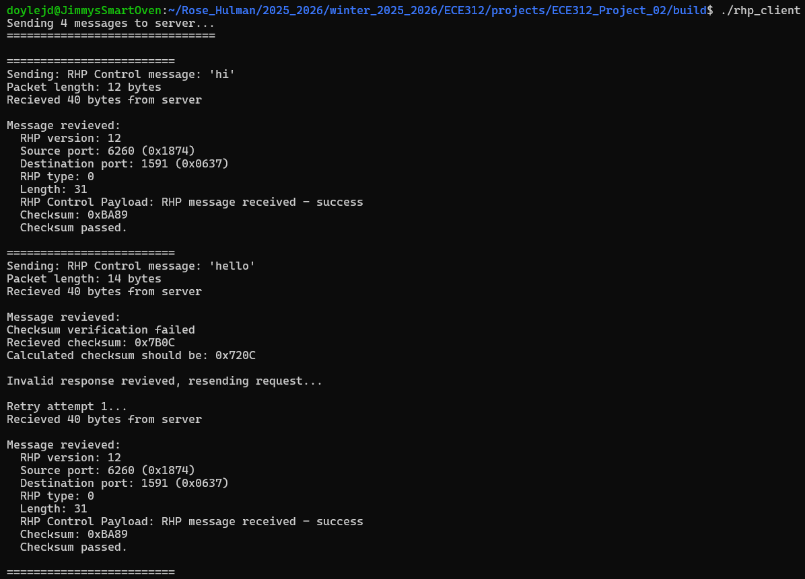
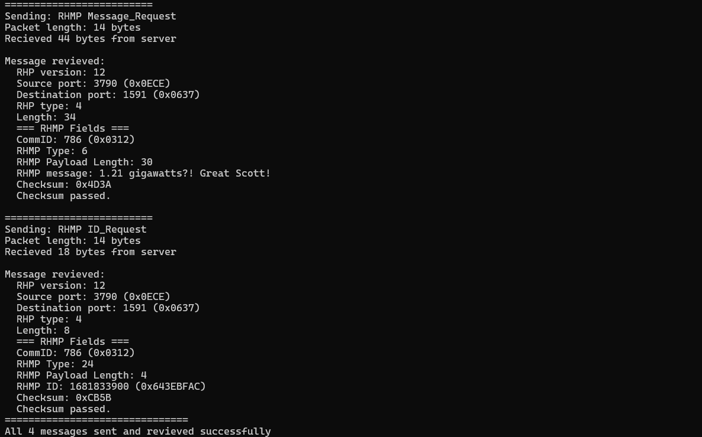
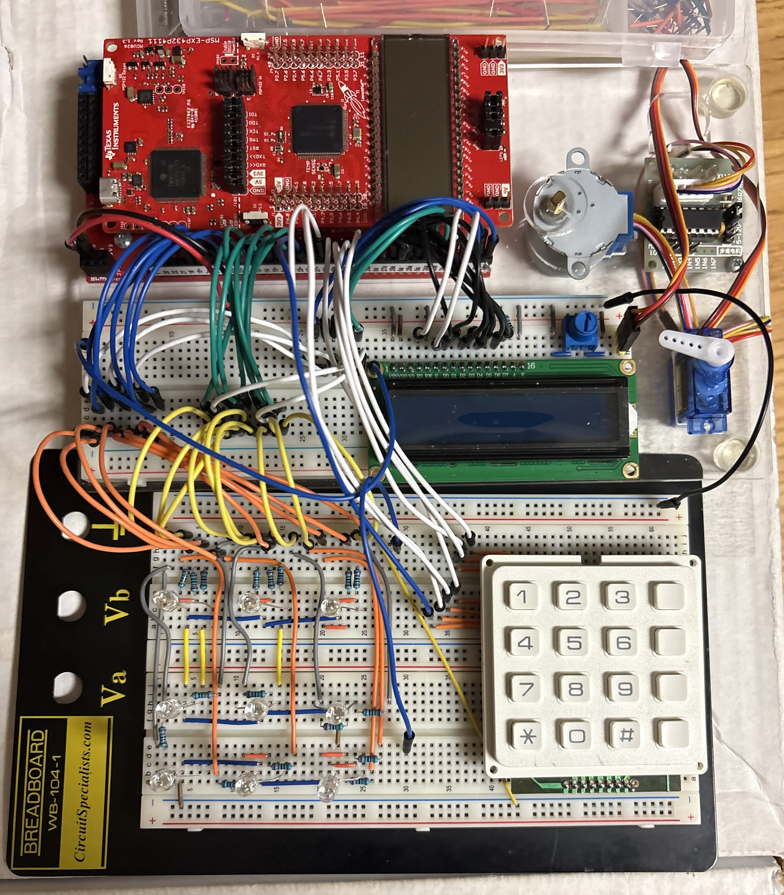

# Joshua Doyle
### Junior Computer Engineer
> Computer Engineering Student at Rose-Hulman Institute of Technology with hands-on experience in hardware design and low-level software development.

---

## Table of Contents
- [About Me](#about-me)
- [RISC-V Assembly Compiler](#risc-v-assembly-compiler)
- [RISC-V Pipelined Processor](#risc-v-pipelined-processor)
- [Two-User TCP Chat Application](#two-user-tcp-chat-application)
- [Custom Packet Encapsulation Protocol](#custom-packet-encapsulation-protocol)
- [Embedded System Tic-Tac-Toe](#embedded-system-tic-tac-toe)
  
---

## About Me
I am a computer engineering major at Rose-Hulman Institute of Technology also pursuing a certificate in Semiconductor Materials and Devices, with experience in both hardware design and low-level software design. My projects range from implementing pipelined processors in Verilog to building networked applications in C, and I am drawn to the overlap between hardware and software.

Before transfering to Rose-Hulman, I studied General Engineering at Westmont College in Califonia, where I competed on the baseball team as a pitcher and got my introduction to computer engineering. Through a talk on campus and one of my design class labs I realized I really enjoyed the software and electrical side of engineering and began thinking about speciallizing in computer engineering.

In my time at Rose-hulman I have learned that within computer eningeering I really like both embedded systems and chip design. Due to my interest in these topics I took a liking the semiconductor industry and decided to also pursue a certificate.

### Education
| Institution | Degree | GPA | Years |
| Institution | Degree | GPA | Years |
|---|---|---|---|
| Rose-Hulman Institute of Technology | B.S. Computer Engineering + Cert. Semiconductor Materials & Devices | 3.14 | Aug 2024 – May 2027 |
| Westmont College | B.S. General Engineering (transferred) | 3.925 | Aug 2023 – May 2024 |
 
**Relevant Courses:** Communication Networks · Computer Architecture I · Digital Systems · Embedded Systems · Electronic Device Modeling · Operating Systems · Circuits and Systems · Data Structures and Algorithms

### Skills
**Languages:** C · C++ · Python · Java · Verilog · MATLAB · ARM Assembly · RISC-V  
**Tools & Software:** Quartus  
**Operating Systems:** Linux · Windows · macOS · Ubuntu

### Honors & Activities
- National Hispanic Recognition Award (2023)
- AP Scholar with Honor (2023)
- IEEE Member (Aug 2024 – Present)
- Westmont College Varsity Baseball — Pitcher (Aug 2023 – May 2024)

---

## RISC-V Compiler

**Language:** Python &nbsp;|&nbsp; **Location:** Terre Haute, IN &nbsp;|&nbsp; **Date:** Sep 2025

### Context

As part of my Computer Architecture I coursework at Rose-Hulman, a team and I built a working compiler to help deepen our understanding of how assembly-level instructions map to machine-executable binary. The compiler was designed to work in tandem with a custom RISC-V processor implementation, forming a complete chain from source code to execution.

### Content

- Developed a Risc-V compiler in Python to translate assembly instructions into hexadecimal machine code
- Implemented a parsing pipeline for instrcution decoding, opcode lookup, and overand validation - supporting R-, I-, S-, B. U-, and UJ-type instruction formats
- Generated machine-level instruction output formatted to be directly loadable into the custom processor's instruction memory
- Validated correctness using structued assembly test programs targetng edge cases
  
### Conclusion

Building this compiler gave me a concrete understanding of how assembly instuctions become binary. This perspective directly informed my processor design work. Tracing a single instruction from source through parsing, encoding, and execution greatly increased my understanding of CPU architecture.

---

## RISC-V Proccessor

**Language:** Verilog &nbsp;|&nbsp; **Location:** Terre Haute, IN &nbsp;|&nbsp; **Date:** Sep 2025

**Repository:** [View Code](https://github.com/doylejoshua/Pipelined_Processor_2025_2026)

### Context

This project was the finale of my Computer Architecture I course. With a team we completed the implementation of a functioning RISC-C processor in Verilog. The goal was to move past single-cycle designs and start approaching how modern CPUs achive throughput through pipelining, while also addresing and resolving hazards within the pipeline. We were able to verify the timing and how hazards are addressed through simulations done in ModelSim.

### Content

- Designed and implemented a 5-Stage pipeline: Instruction Fetch (IF) -> Insturction Decode -> (ID) -> Execute (EX) -> Memory Access (MEM) -> Write-Back (WB)
- Build hazard detection logic to indentify RAW (Read after Write) data hazards and inserted pipeline stalls when necessary
- Implemented forwarding paths from EX/MEM and MEM/WB staged back to EX to minimize stall cycles
- Handled control hazards from branch instructions with appropriate pipeline flush logic
- Developed Verilog testbenches to simulate pipeline behavior and verify timing and functional correctness across multiple instruction sequences
- Used the RISC-V Assembly Compiler (above) to generate hex instruction input for end-to-end testing

### Conclusion

Implementing pipelining from scratch made hazard handling a real engineering problem filled with design choices and trade offs. Debuggin subtle timing issues required careful reasoning about which instruction was in which pipeline stage at every clock cycle, which build strong intuition for how real processors manage insturction-level parallelism. 

---

## Two-User TCP Chat Application

**Language:** C &nbsp;|&nbsp; **Platform:** Linux &nbsp;|&nbsp; **Location:** Terre Haute, IN &nbsp;|&nbsp; **Date:** Dec 2025

**Repository:** [View Code](https://github.com/doylejoshua/TCP_Chat_Application_2025_2026)

### Context

Built as part of my Communication Networks coursework, this project involved implementing a real-time two-host chat application using socket programming in C within a Linux enviorment. The goal was to understand the mechanics of TCP connection establisment, bidirectional daat flow, and graceful session termination at the application layer. This was tested accross the country with my partner through the use of a school VPN.

### Content

- Designed a username exchange handshake on connection establishment, displaying each side's IP address and chosen username
- Enabled continuous bidirectional message exchange using 'send()' and 'recv()'
- Implemented a defined exit protocol to gracefully close both client and server sockets and terminate both processes cleanly

### Conclusion

This project helped bring realworld application to TCP/IP concepts from lecture into actual working code. Handling edge cases like connection teardown and ensuring both sides exited cleanly without waiting on more messages gave me hands-on experience with real-world socket programing. In addition while in this project we did not use threads in a class taken in tandem, Operating Systems we learned aboout threads and talked about how in the future they could be used for concurent send/recieve.

---

## Custom Packet Encapsulation Protocol

**Language:** C &nbsp;|&nbsp; **Transport:** UDP &nbsp;|&nbsp; **Location:** Terre Haute, IN &nbsp;|&nbsp; **Date:** Feb 2026

**Repository:** [View Code](https://github.com/doylejoshua/Custom_Protocol_2025_2026)

### Contect

This project extended my Communication Networks courseowkr bu implementing two custom application-layer protocols - Rose-Hulman Protocol (RHP) and Rose-Hulman Message Protocol (RHMP) - layered above UDP. The assigment simulated the design and implementation of a real protocol stack, including header construction, checksum validation, and retransmission logic.

### Content

- Implemented custom protocol headers with versioning, message type fields, and payload length -manually construting and parsing byte-level packet structures in C
- Calculated and validated 16-bit Internet checksums over packet heeaders and payloads to detect data corruption in transit
- Handled server respoonses end-to-end: parsing returned packets, validating checksums, and triggering retransmission when validation failed
- Built the full protocol stack above raw UDP sockets with no reliance on higher-level transport abstractions

  
### Conclusion

Implementing a protocol stack from scratch — rather than calling a library — made the layers of the network model concrete. Manually computing checksums, packing header fields into byte arrays, and writing retransmission logic gave me a much deeper appreciation for what protocols like TCP handle automatically under the hood.

---
## Embedded System Tic-Tac-Toe

**Language:** C &nbsp;|&nbsp; **Hardware:** Texas Instruments Microcontroller &nbsp;|&nbsp; **Location:** Terre Haute, IN &nbsp;|&nbsp; **Date:** Feb – Mar 2025

### Context
Developed during my Embedded Systems coursework, this project involved implementing a fully playable two-player Tic-Tac-Toe game on a Texas Instruments microcontroller. The goal was to integrate hardware I/O with software game logic running on bare-metal embedded C, without an operating system.

### Content

- Wrote embedded C firmware to manage all game logic and hardware I/O on the microcontroller
- Represented the 3×3 board as an array and implemented win-detection logic checking all rows, columns, and diagonals after each move
- Configured GPIO pins to read debounced pushbutton inputs for player move selection and drive LED outputs for real-time board state display
- Managed turn alternation, invalid-move rejection, and end-game state (win/draw) with visual LED feedback

### Conclusion

This project bridged software logic and physical hardware in a way that purely software projects do not. Debugging required both a hardware mindset and a software mindset expanding on what previous software only classes had taught us. It reinforced the embedded discipline of writing simple and working code where every pin state and clock cycle matters.
